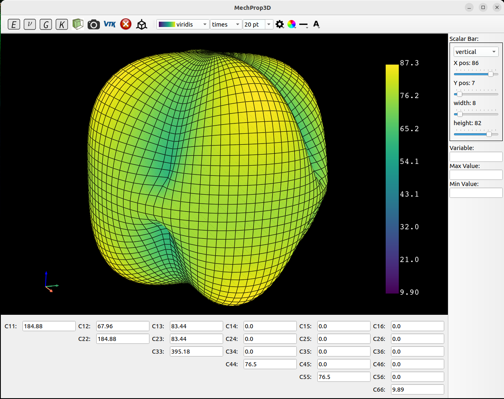

# MechProp3D

  



MechProp3D is a GUI interface viewer for 3D visualization of elastic properties.

It is an open source Python library that uses [pyvista's][1] library.

## Installation for development

After cloning the repository:

```
conda env create -f environment_.yml -n <name_of_my_environment>
conda activate <name_of_my_environment>
python setup.py install
```

## Quick-start 

usage: MechProp3D

[-styleshee] : To change display style.

## Authors

* [x] Kais AMMAR


[1]: https://www.pyvista.org/
